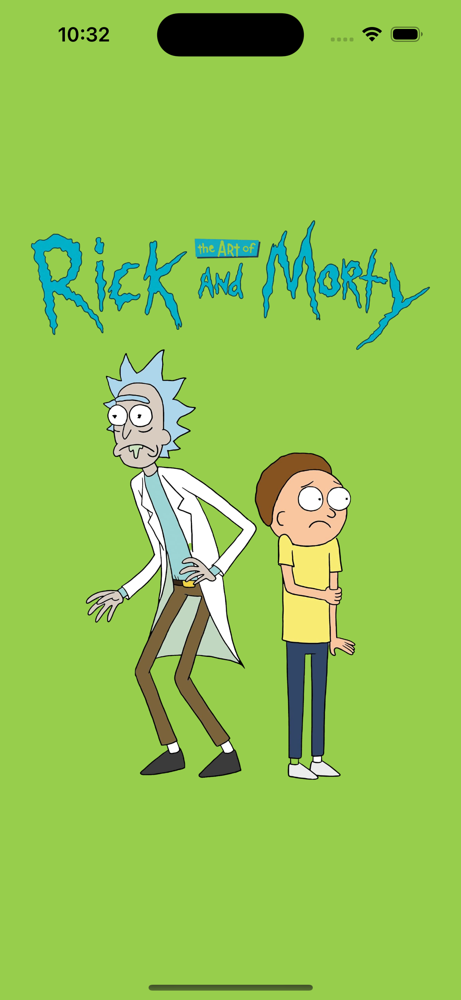
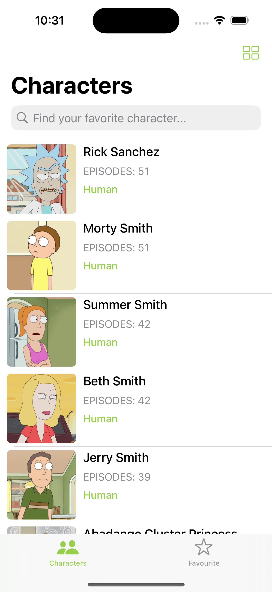
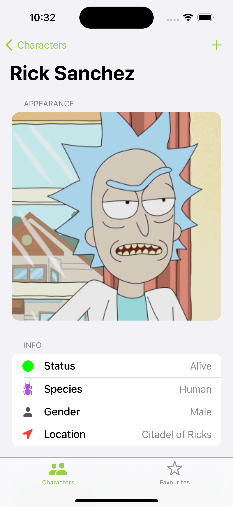

<h2> 𝐇𝐞𝐥𝐥𝐨 𝐭𝐡𝐞𝐫𝐞, <𝚌𝚘𝚍𝚎𝚛𝚜/>! </h2>


[Instagram](https://instagram.com/code_with_rohit?igshid=71vfqs608pnw)

I am Rohit Jangid 😃. I am from Maharashtra, India. I am passionate about iOS development and love talking about tech. Apart from iOS Development, JavaScript is my partner, and I also work with MERN.

## ⚡ Technologies
Talk to me about:
- iOS application development **Xcode & Swift**

## Hello World!! 🤔
- 💬 Feel free to ask or discuss about iOS and tech.

---

## 🚀 Rick and Morty App

### **About This App**
This is a **Rick and Morty character browser app** that allows users to explore characters from the Rick and Morty universe. The app fetches data from the [Rick and Morty API](https://rickandmortyapi.com/) and displays characters with their details.

### **🛠️ Tech Stack**
- **Architecture:** MVVM (Model-View-ViewModel)
- **Framework:** UIKit
- **UI Implementation:** Storyboard + Programmatic UI
- **Networking:** URLSession
- **Data Handling:** Codable for JSON parsing
- **Image Caching:** NSCache for optimized performance

### **📌 Features**
✅ Fetch and display character details from the **Rick and Morty API**  
✅ Uses **MVVM architecture** for clean code and scalability  
✅ Implemented **both Storyboard and Programmatic UI**  
✅ **Search functionality** to filter characters  
✅ **Pagination support** for optimized API calls  
✅ **Image caching** to reduce unnecessary network requests  

### **📷 Screenshots**
#### Home Screen


#### Home Screen



#### Character Details


### **🛠️ Installation**
1. Clone the repository:
   ```sh
   git clone https://github.com/rohit155/RickAndMortyApp.git
   cd RickAndMortyApp
